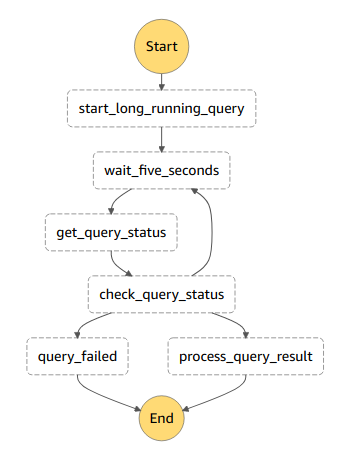

# Serverless Athena Demo

## Introduction

This is the companion repository to a blog post you can find [INSERT LINK HERE]

It includes a wrapper for calls to AWS Athena in the `athena_helper.py` which makes it a little easier to automate Athena.
Furthermore this repository contains a [serverless](serverless.com) application that demos two use cases for the Athena Helper.

## Long running queries

For long running queries it makes sense to use a step function instead of having a lambda function waste CPU cycles.
The step function in this repository looks like this:



You can try this by logging in to your AWS Console, switching to the step function service and starting a new Invocation of the state machine.

The output should look something like this:

```json
{
  "output": {
    "MyQueryExecutionId": "4af4ae51-793a-4a19-91bc-343ff0b5a5be",
    "WaitTask": {
      "QueryExecutionId": "4af4ae51-793a-4a19-91bc-343ff0b5a5be",
      "ResultPrefix": "Sample",
      "QueryState": "SUCCEEDED"
    },
    "SampleStatusInformation": {
      "QueryState": "SUCCEEDED",
      "ExecutionTimeInMillis": 1825,
      "StateChangeReason": null,
      "DataScannedInBytes": 848167
    },
    "GotResult": true
  }
}
```

## Short running queries

You can try this by logging in to your AWS Console, switching to the Lambda function and triggering it.
Any event will work, the function doesn't care about those.

The output should look something like this:

```json
{
  "UpdateCount": 0,
  "ResultSet": {
    "Rows": [
      {
        "Data": [
          {
            "VarCharValue": "elb_name"
          }
        ]
      },
      {
        "Data": [
          {
            "VarCharValue": "elb_demo_007"
          }
        ]
      }
    ],
    "ResultSetMetadata": {
      "ColumnInfo": [
        {
          "CatalogName": "hive",
          "SchemaName": "",
          "TableName": "",
          "Name": "elb_name",
          "Label": "elb_name",
          "Type": "varchar",
          "Precision": 2147483647,
          "Scale": 0,
          "Nullable": "UNKNOWN",
          "CaseSensitive": true
        }
      ]
    }
  },
  "ResponseMetadata": {
    "RequestId": "753eb69a-b353-4929-b027-ba84662ad296",
    "HTTPStatusCode": 200,
    "HTTPHeaders": {
      "content-type": "application/x-amz-json-1.1",
      "date": "Tue, 11 Jun 2019 14:42:24 GMT",
      "x-amzn-requestid": "753eb69a-b353-4929-b027-ba84662ad296",
      "content-length": "604",
      "connection": "keep-alive"
    },
    "RetryAttempts": 0
  }
}
```

## How to use

1. Make sure you have the Serverless Framework installed and properly configured
1. Make sure your AWS credentials are set up correctly
1. Make sure to have used Athena at least once in your region (otherwise the S3-Bucket won't be created)
1. Run `serverless deploy`
1. Log in to your AWS Console and play
1. When you're finished run `serverless remove` to remove the resources